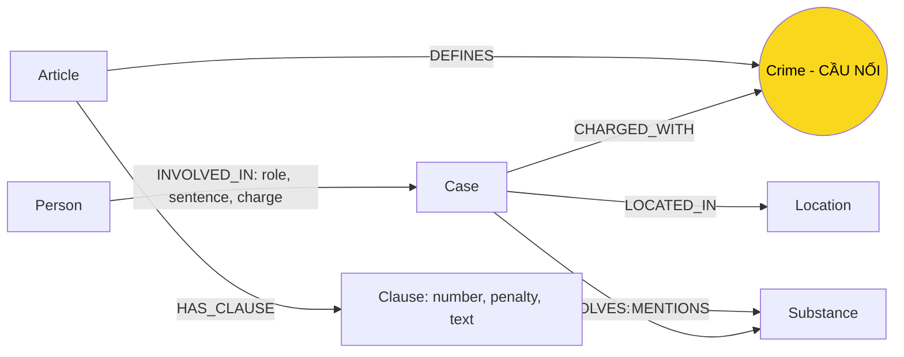

# Thiết kế Ontology — Day 19

**Họ tên:** Võ Công Danh  **MSSV:** 2A202602739

**Lựa chọn** (đánh dấu một):
- [x] Dùng ontology gợi ý (có thể chỉnh nhỏ)
- [ ] Tự thiết kế (xét bonus +15, xem `SUBMISSION.md`)

> Hướng dẫn: `LAB_GUIDE.md` Bước 2. Dùng ontology gợi ý thì vẫn phải điền đủ các mục dưới đây bằng lời của bạn.

## 1. Sơ đồ

Vẽ bằng mermaid (hoặc chèn ảnh `report/img/ontology.png`). Đánh dấu rõ **node cầu nối**.

## 2. Entity types (node labels)

| Label | Ý nghĩa | Khóa định danh (`MERGE` theo) | Properties | Lấy từ KB nào | Trích bằng (regex / LLM / khác) |
| --- | --- | --- | --- | --- | --- |
| `Article` | Một Điều luật (BLHS hoặc Luật PCMT) | `id` ("Điều 251 BLHS") | `title`, `law`, `doc_id` | Luật | regex (`parse_law_article`) |
| `Clause` | Một khoản của Điều luật, kèm khung hình phạt | `id` ("Điều 251 BLHS khoản 1") | `number`, `penalty`, `text`, `doc_id` | Luật | regex (`CLAUSE_START`) |
| `Crime` | Tên tội danh chuẩn hóa. **Node cầu nối** | `name` (chữ thường, bỏ tiền tố "Tội") | `name` | Luật (tiêu đề Điều); tin tức nối vào | regex ở luật; LLM + `link_entity` ở tin |
| `Substance` | Chất ma túy (MDMA, Ketamine...) | `name` | `name` | Cả hai | `find_substances` ở luật; LLM ở tin |
| `Case` | Một vụ án/sự kiện trong bài báo | `name` (do LLM đặt) | `summary`, `date`, `doc_id`, `source_title` | Tin | LLM (`extract_news_cases`) |
| `Person` | Bị cáo, bị can, nghi phạm, người liên quan | `name` | `aliases` | Tin | LLM |
| `Location` | Tỉnh/thành phố của vụ | `name` | `name` | Tin | LLM |

Node sinh ra từ đúng một tài liệu (`Article`, `Clause`, `Case`) mang `doc_id` = `Document.id`. `Crime`, `Substance`, `Person`, `Location` là node dùng chung nên không có `doc_id`.

## 3. Relationships

| Type | Từ → Đến | Properties trên cạnh | Ý nghĩa |
| --- | --- | --- | --- |
| `DEFINES` | `Article` → `Crime` | | Điều luật định nghĩa tội danh |
| `HAS_CLAUSE` | `Article` → `Clause` | | Điều gồm các khoản |
| `MENTIONS` | `Clause` → `Substance` | | Khoản nhắc tới chất ma túy |
| `CHARGED_WITH` | `Case` → `Crime` | | Vụ án bị truy tố/buộc tội này. Cạnh nối 2 KB |
| `INVOLVES` | `Case` → `Substance` | `amount` | Vụ án liên quan tới chất, kèm khối lượng |
| `LOCATED_IN` | `Case` → `Location` | | Vụ xảy ra hoặc xét xử ở đâu |
| `INVOLVED_IN` | `Person` → `Case` | `role`, `sentence`, `charge` | Người tham gia vụ, vai trò, mức án, tội danh của riêng người đó |

## 4. Node cầu nối giữa 2 KB

- **Node nào:** `Crime`.
- **Vì sao chọn node này:** cả hai KB đều gọi tên tội. Luật dùng nó làm tiêu đề Điều ("Tội mua bán trái phép chất ma túy"), còn báo nêu nó khi nói bị cáo bị xử về tội gì. Tên tội là thực thể ổn định, ít biến thể hơn tên người hay tên vụ. Từ `Crime` đi được sang Điều và khoản, tức là khung hình phạt.
- **Cách đảm bảo hai phía khớp tên:**
  1. Phía luật: `normalize_crime(title)` (bỏ tiền tố "Tội", chữ thường, gọn khoảng trắng).
  2. Phía tin: đưa `DANH SÁCH TỘI DANH` (tên chuẩn từ luật) vào prompt để LLM chọn đúng nguyên văn.
  3. Vì LLM không luôn tuân thủ, mọi tội danh LLM trả về vẫn qua `link_entity` (chuẩn hóa hai phía, khớp chính xác, rồi `difflib` cutoff 0.8). Không đủ giống thì trả `None` và bỏ cạnh, vì nối sai tệ hơn không nối.
- **Khi nào cầu gãy, và xử lý thế nào:**
  - Bài không nói về vụ án cụ thể (hội nghị, tuyên truyền, mô hình "không ma túy"): prompt trả `{"cases": []}`. Không có `Case` thì không có cầu, và điều này hợp lý.
  - Báo chỉ nêu hành vi chứ không nêu tội danh (ví dụ "sử dụng ma túy" khi bị bắt, hay vụ tai nạn giao thông có ma túy): `link_entity` trả `None`, `Case` không có `CHARGED_WITH`. Cách xử lý: kiểm bằng `MATCH (k:Case) WHERE NOT (k)-[:CHARGED_WITH]->() RETURN k.name, k.doc_id`, mở bài gốc xem vụ đó có nên nối không.
  - Tội danh bị gõ lệch nhiều (dưới ngưỡng 0.8): bị bỏ. Giảm ngưỡng thì có nguy cơ nối nhầm sang tội khác (ví dụ "tàng trữ" và "vận chuyển").

## 5. Competency questions

Đường đi dưới đây viết theo ontology gợi ý. "Có" nghĩa là ontology có đủ node và cạnh để trả lời; kết quả thực tế còn phụ thuộc vào trích xuất của LLM và Cypher ở KG-3.

| Câu | Đường đi (Cypher pattern) | Trả lời được? |
| --- | --- | --- |
| Q1 (tiền chất là gì) | `(:Article {id:'Điều 2 Luật PCMT'})-[:HAS_CLAUSE]->(:Clause)`, đọc `Clause.text` | **Một phần.** Đây là câu định nghĩa, không phải quan hệ giữa các thực thể, nên graph không thêm giá trị. Phải dựa vào chunk của vector search. Graph không làm hại nhưng cũng không giúp. |
| Q2 (bị cáo nào lãnh án tử hình, vụ 36kg) | `(p:Person)-[r:INVOLVED_IN]->(k:Case)` với `r.sentence` chứa "tử hình" và `k.name` của vụ 36kg | **Có** (single-hop trong KB tin). Chunk cũng đủ trả lời. |
| Q3 (Lê Minh Thành: án, tội, Điều, khung phạt) | `(p:Person {name:'Lê Minh Thành'})-[r:INVOLVED_IN]->(k:Case)-[:CHARGED_WITH]->(c:Crime)<-[:DEFINES]-(a:Article)-[:HAS_CLAUSE]->(cl:Clause {number:1})`. Lấy `r.sentence`, `c.name`, `a.id`, `cl.penalty`. | **Có.** Đây là trường hợp mà GraphRAG có lợi thế rõ nhất. |
| Q4 ("Hoàng Nato": hành vi và phạt tối đa) | `(p:Person)` có `'Hoàng Nato' IN p.aliases` rồi như Q3, tới `Clause` của Điều 255 | **Một phần.** Tìm được người qua `aliases` và tìm được Điều 255. Nhưng "phạt tối đa" cần khoản có hình phạt cao nhất, mà quy tắc lọc gợi ý chỉ giữ khoản 1 và khoản nhắc tới chất của vụ. Vụ "Hoàng Nato" liên quan etomidate, chất này không nằm trong `SUBSTANCES`, nên các khoản cao bị bỏ (lỗi E2). |
| Q5 (Cái Quang Huy: tội, chất, khoản áp dụng với MDMA) | `(p:Person {name:'Cái Quang Huy'})-[:INVOLVED_IN]->(k:Case)-[:CHARGED_WITH]->(c:Crime)<-[:DEFINES]-(a:Article)-[:HAS_CLAUSE]->(cl:Clause)`, thêm `(k)-[:INVOLVES]->(s:Substance)<-[:MENTIONS]-(cl)` | **Một phần.** Tìm được Điều 250 và các khoản nhắc MDMA, nhưng ontology **không có ngưỡng khối lượng** trên `Clause`. Các khoản 2, 3, 4 đều nhắc MDMA nên không chọn được "khoản 4" theo 9,6kg. Việc chọn khoản dựa hoàn toàn vào LLM đọc `text`. |
| Q6 (vụ nào liên quan MDMA) | `(k:Case)-[:INVOLVES]->(:Substance {name:'MDMA'})` | **Có**, với điều kiện LLM đã trích `MDMA` thành `Substance` ở mọi bài liên quan. Câu `aggregation` này dễ lỗi E3 (trùng tên chất) và E5 (LLM bỏ sót hoặc thêm vụ). |

## 6. Quyết định thiết kế và đánh đổi

1. **Trích xuất luật bằng regex, tin tức bằng LLM.**
   - Chọn: regex cho luật (`parse_law_article`), LLM cho tin (`extract_news_cases`).
   - Thay thế: dùng LLM cho cả hai.
   - Vì sao: văn bản luật có cấu trúc rất đều (Điều → khoản → điểm), nên regex rẻ, nhanh, cho cùng kết quả mỗi lần chạy và không tốn token. Tin tức là văn xuôi tự do, không thể viết regex cho tên người, vai trò, mức án. Đánh đổi: regex dễ vỡ nếu định dạng luật đổi, và LLM làm graph phần tin không ổn định giữa các lần chạy.
2. **Chọn `Crime` làm node cầu nối, và tách tới mức `Clause` (không tách tới điểm a), b)).**
   - Chọn: `Crime` nối `Case` với `Article`; mức chi tiết dừng ở khoản.
   - Thay thế: cầu nối qua `Substance`, hoặc thêm node `Point` cho từng điểm.
   - Vì sao: tên tội có ở cả hai phía và dẫn thẳng tới khung hình phạt. Chất ma túy không xác định được hình phạt nếu thiếu khối lượng. Dừng ở khoản giữ graph nhỏ (khoảng 100 `Clause` cho 18 điều), prompt ngắn. Đánh đổi: mất chi tiết ở cấp điểm, nên Q5 không chọn được khoản theo ngưỡng khối lượng.
3. **Vẫn dùng vector search, graph chỉ bổ sung.**
   - Chọn: GraphRAG lấy cùng top-k chunk như Flat RAG, rồi thêm dữ kiện từ graph (hybrid).
   - Thay thế: chỉ dùng graph để trả lời.
   - Vì sao: graph chỉ phủ những gì LLM trích được. Câu thuần văn bản như Q1 phải nhờ chunk. Hybrid đảm bảo GraphRAG không kém Flat RAG về ngữ cảnh. Đánh đổi: prompt dài hơn nên mỗi câu hỏi tốn token và tiền hơn.
4. **Khóa `MERGE` theo `name`.**
   - Chọn: `Case`, `Person`, `Substance`, `Location` khóa theo `name`, `Crime` theo tên đã chuẩn hóa.
   - Thay thế: khóa tổng hợp (tên + tuổi, hoặc `doc_id` + chỉ số vụ), hoặc sinh id riêng.
   - Vì sao: đơn giản, đủ cho bản gợi ý và `MERGE` hoạt động ngay. Đánh đổi: tên do LLM đặt nên dễ trùng hoặc gộp sai (xem mục 8).

## 7. So với ontology gợi ý (bắt buộc nếu xét bonus)

Không áp dụng. Bài này dùng nguyên ontology gợi ý và không xét bonus.

## 8. Hạn chế còn lại

- **Không có ngưỡng khối lượng trên `Clause`.** Không chọn được khoản theo khối lượng chất (Q5), và quy tắc lọc khoản dễ bỏ sót mức phạt tối đa (Q4).
- **Khóa theo tên.** `Case` và `Person` khóa theo tên do LLM tự đặt. Cùng một vụ có thể thành nhiều node nếu hai bài đặt tên khác nhau, hoặc hai vụ khác nhau bị gộp thành một.
- **Alias không gộp được người.** "Hoàng Nato" và "Dương Minh Tuấn" là một người nhưng có thể tạo hai node `Person`. Ngược lại "Trần Thanh Tuấn" và "Kim Xuân Tuấn" là hai người khác nhau nên không được gộp theo tên cuối.
- **`Substance` chưa chuẩn hóa tên từ tin tức.** Regex phía luật chỉ nhận các chất trong `SUBSTANCES`, còn LLM phía tin có thể tạo thêm tên ngoài danh sách như etomidate. Graph sau benchmark có cả `Ketamine`/`ketamine` và `Methamphetamine`/`methamphetamine`; các node lệch tên có thể không nối được sang khoản luật tương ứng.
- **Một bài có thể chứa nhiều vụ.** Bài về Lê Minh Thành có đoạn cuối nhắc sang vụ Cái Quang Huy. Cách lấy `doc_id` của `Case` theo bài có thể gán sai nguồn.
- **Không phân biệt giai đoạn tố tụng** (bắt, khởi tố, sơ thẩm, phúc thẩm). Vụ Lê Minh Thành đang chờ phúc thẩm, nhưng graph chỉ lưu `sentence` của sơ thẩm.
- **Đã đối chiếu graph sau benchmark ngày 06/10/2026.** Có đủ 7 label: Article (18), Clause (99), Crime (13), Case (14), Substance (17), Person (36), Location (7), tổng 204 node. Có đủ 7 loại quan hệ trong mục 3: DEFINES (13), HAS_CLAUSE (99), MENTIONS (169), CHARGED_WITH (19), INVOLVES (24), LOCATED_IN (14), INVOLVED_IN (44), tổng 382 cạnh. Truy vấn kiểm tra là `MATCH (n) RETURN labels(n)[0] AS label, count(*) AS n` và `MATCH ()-[r]->() RETURN type(r) AS rel, count(*) AS n`; đây là kết quả của lần chạy hiện tại, có thể thay đổi khi LLM trích xuất lại.
